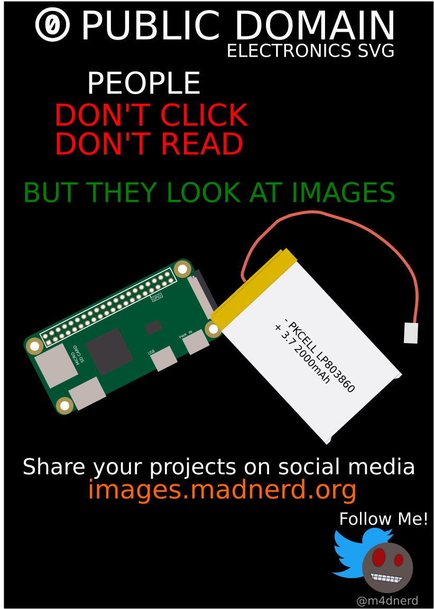

# publicDomainSVG
Share your open-hardware projects on social media thanks to my images !    
You can contribute to this library by forking it and adding your own components.

Keep in mind, all your contributions will be placed as public domain so it can't use copyrighted materials.

* [Components](https://github.com/maditnerd/publicDomainSVG/tree/master/components)
* [Tools](https://github.com/maditnerd/publicDomainSVG/tree/master/tools)

