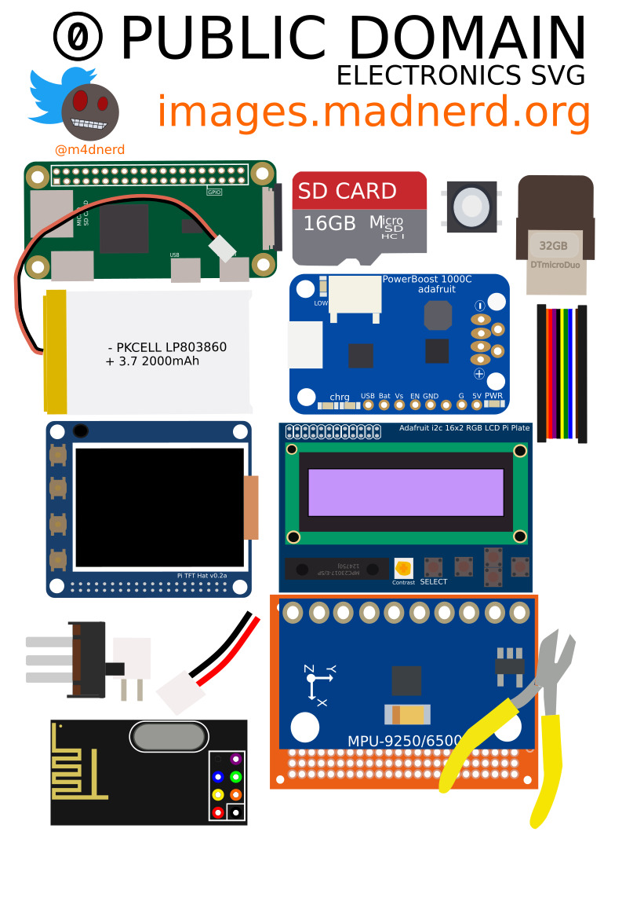

# Public Domain Electronics SVG
Share your open-hardware projects on social media thanks to my images !    
You can contribute to this library by forking it and adding your own components.

Follow me on twitter at [@m4dnerd](https://twitter.com/m4dnerd) for examples on how to use images to share your knowledge

Keep in mind, all your contributions will be placed as public domain so you can't use copyrighted materials.

* [Components](https://github.com/maditnerd/publicDomainSVG/tree/master/components)
* [Tools](https://github.com/maditnerd/publicDomainSVG/tree/master/tools)

