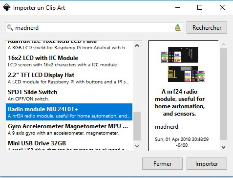

>[Downloads](https://github.com/maditnerd/publicDomainSVG/archive/master.zip) ___
[Github](https://github.com/maditnerd/publicDomainSVG/) ___
[Openclipart.org](https://openclipart.org/user-detail/madnerd) ___
[Twitter](https://twitter.com/m4dnerd)

Public Domain SVG is a repository of **electronics components** images.   

## How to search images on inkscape.
All images published on openclipart.org are available directly inside inkscape.

* Go to File --> Import Clip Art
* Search Madnerd   

## Request new components
Don't find your components ?   
Request it on github : https://github.com/maditnerd/publicDomainSVG/issues

## Contribute
* You can submit your own SVG on github using **Upload files**
* Or you can submit it on openclipart.org using **madnerd** as a tag

Keep in mind your images will be published as [CC-0 Public Domain](https://creativecommons.org/publicdomain/zero/1.0/).

>By uploading SVG Clipart, you are asserting that you are uploading and sharing clipart already in the public domain, you are the creator, or you are the legal owner of the clipart. By uploading clipart to this site, you are waiving all copyright and related or neighboring rights. Please do not upload any trademarked images such as characters or logos. Have fun!   

openclipart.org

## Examples
* [http://console.madnerd.org/](http://console.madnerd.org/)
* [https://github.com/maditnerd/tinypi-guide](https://github.com/maditnerd/tinypi-guide)

## Author
* Rémi Sarrailh [@m4dnerd](https://twitter.com/m4dnerd)

